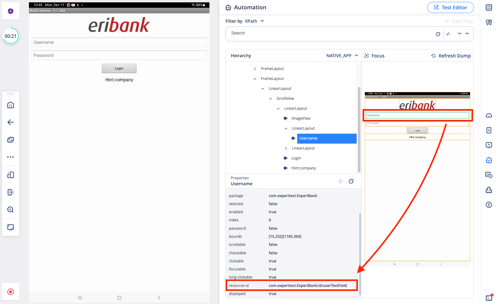
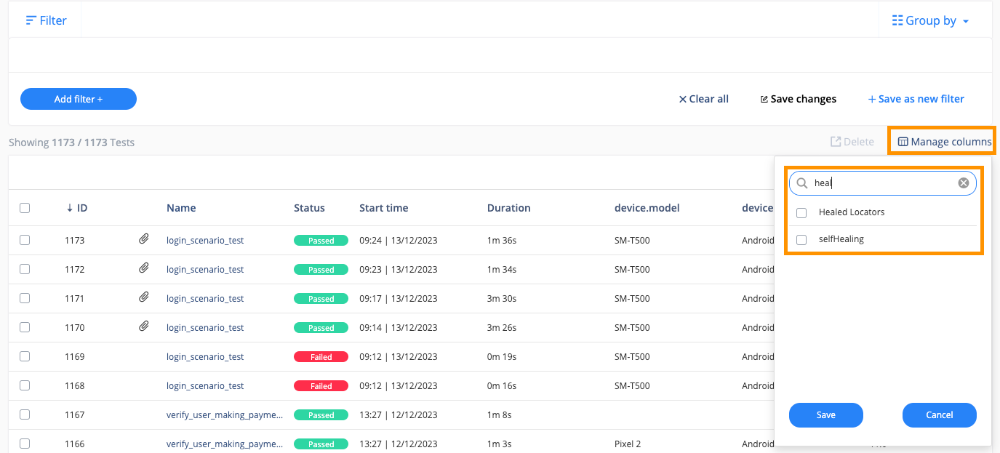
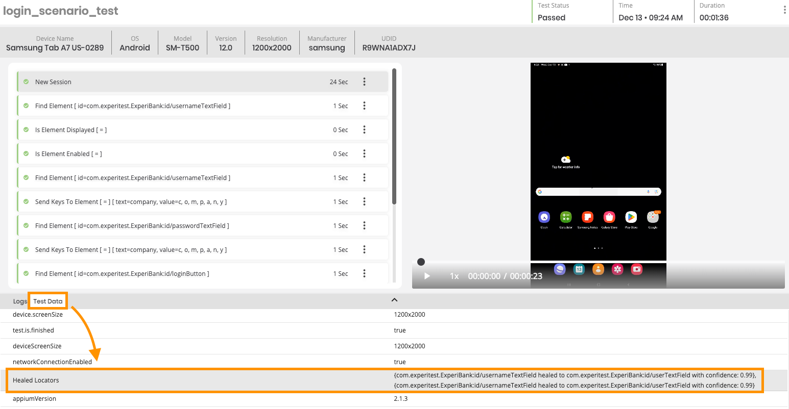

## Digital.ai Continuous Testing - Appium Self-Healing

Digital.ai AI-Powered Self-Healing uses AI techniques to understand and repair element mismatches autonomously without human intervention.

### Prerequisites

1. Only works on SaaS Hosted Environments
2. If you are a SaaS based customer and Self Healing is not enabled, reach out to support@digital.ai to have it enabled

### Limitations

Self-Healing does not work with Native iOS Tests. It works with iOS Web, Android Native & Web.

Support for Native iOS Tests coming soon . . .

### Test Setup

Provide your Cloud URL and Access Key in ```config.properties``` file.

[Obtain your Access Key](https://docs.digital.ai/bundle/TE/page/obtaining_access_key.html)

### Description of Test Logic

For Demonstration purposes, we will be using an Android APK Application, developed by Digital.ai.

Two application builds will be used, one build that is **UNMODIFIED**:


And one build that is **MODIFIED**, the username Text Field locator has changed:



The Automated Script in **SelfHealingTest.java** is a simple test, that will perform the following steps:

- Enter "company" into Username Text Field
- Enter "company" into Password Text Field
- Click on the Login Button
- Verify user landed on Dashboard

### Running the Tests

#### When Self-Healing is disabled

With Self-Healing disabled, the first test will pass against the unmodified build. The second test will always fail against the modified build.

To try this out, run the following command from your Terminal window:

```agsl
mvn clean test -DxmlFile=regular_tests.xml
```

#### When Self-Healing is enabled

With Self-Healing enabled, the first test will pass against the unmodified build. The second test will also pass, even though it is running against a modified build.

The Self-Healing kicks in as it will detect that the Username Text Field locator has changed, automatically finding the most appropriate replacement, and continue running the test.

To try this out, run the following command from your Terminal window:

```agsl
mvn clean test -DxmlFile=self_healing_tests.xml
```

### Viewing the Test Results

Navigate to your Continuous Testing Reporter page:

```
https://<your_cloud_url>/reporter/reporter/tests
```

Under "Manage Columns", search for the word Heal, and you should see two attributes, "Healed Locators" and "selfHealing":



Select both and click on Save.

Once saved, the column will now reflect tests that ran with Self-Healing and if any tests Healed:


You can also open up the individual Test Reports to find the specific details about what was Healed:



### References

[Docs - Digital.ai Self Healing Documentation](https://docs.digital.ai/bundle/TE/page/appium_self-healing.html)

[YouTube - Digital.ai Self Healing Demo](https://www.youtube.com/watch?v=pfSQm1NHj4s)

APK files can be downloaded here if needed:

- [SeeTestDemoApp](https://applicationsforselfhealing.s3.us-east-2.amazonaws.com/com.experitest.ExperiBank_.LoginActivity_UNMODIFIED.apk) (UNMODIFIED)

- [SeeTestDemoApp](https://applicationsforselfhealing.s3.us-east-2.amazonaws.com/com.experitest.ExperiBank_.LoginActivity_MODIFIED.apk) (MODIFIED)